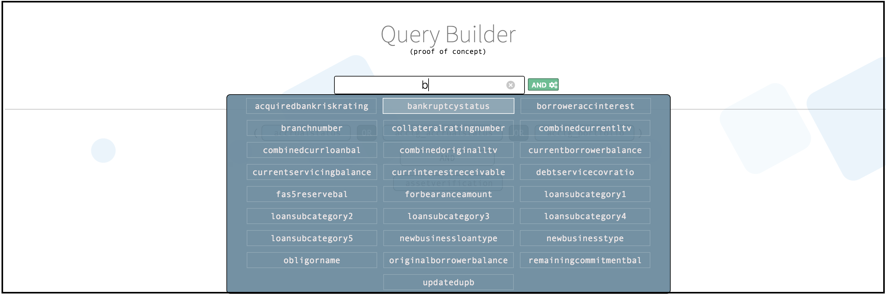

# Query Builder Proof of Concept 0.0.1

Query Builder is a proof of concept that allows a researcher to construct queries comprised of groupings of medical terms.  Please note, the first iteration of this app is intended for use for desktop machines only per our present use case, it is not yet optimized for mobile.


Go **[here](https://bendcarmen.github.io/query-tool/)** for a live demo.

## Getting Started:

**The user can click on the input box to show available terms and filter them by entering text**


**The user can then select a term they want to add to the query**


**As the user continues to add terms, terms in a group will be automatically joined with an 'OR' operator**


**The user can click the 'AND' button to start a new group**


**The user can use the input to select terms to add to the newly created group**

*filter terms:*


*add a term to the new group*


**The user can also delete terms by clicking the 'X' it's upper right corner**


### Install

Follow these steps to get development environment running.

### Prerequisites

The following software is required to run this app locally:

* **[Node](https://nodejs.org/)**  8.x
* **[NPM](https://www.npmjs.com/)** 5.x 
* **[Yarn](https://yarnpkg.com/lang/en/)** 1.x 

* Clone __'query_builder'__ repository from GitHub

  ```bash
  git clone https://github.com/bendcarmen/query-builder
  ```
* Install node modules

   ```bash
   cd query-builder
   yarn
   ```

* Fire up the app locally and watch for changes while developing

  ```bash
  yarn start
  ```

The app will be available at **[http://localhost:8888/](http://localhost:8888/)**  after launching.


### 0.0.2 Roadmap:
* Responsive for mobile.
* Allow a term to be negated '!'
* Allow for groups to be deleted
* Allow for groups to be negated '!'

### Feature Considerations
* add toggle to 'AND' and 'OR' operators
* time and value constraints


